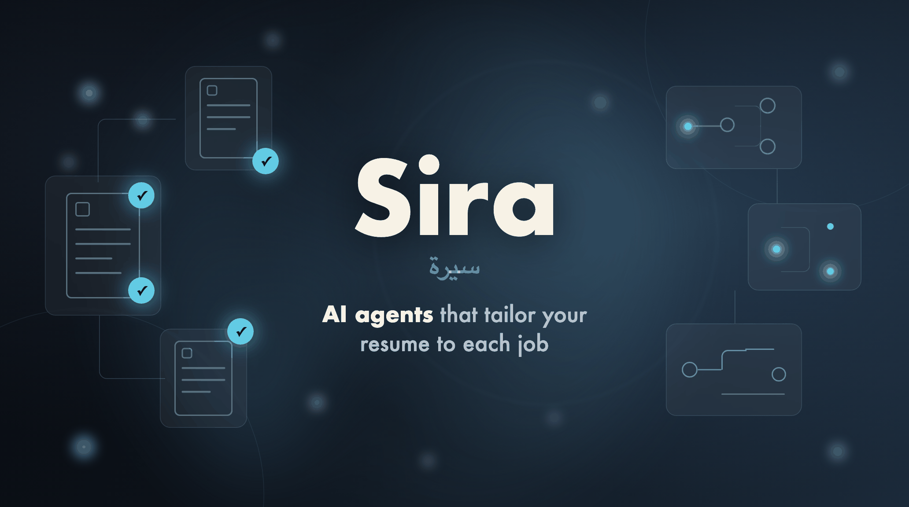

# 📄 Sira



Sira is a multi-agent AI system that analyzes job postings and tailors your resume to match specific job requirements. It ensures authenticity, avoids AI clichés, and optimizes for Applicant Tracking Systems (ATS).

> **Sira** (سيرة) is the Arabic word for a life story. *Sīra dhātiyya* (سيرة ذاتية) is the term for a curriculum vitae — the story you tell about your own work.

## 🚀 Features

- **Multi-Agent Architecture**: 6 pipeline stages plus job scraping — dedicated agents for analysis, writing, and quality assurance.
- **Automated Job Scraping**: Fetches job posting content from any public URL using Playwright.
- **Resume Memory**: Stores your original resume plus job-specific tailored outputs in SQLite.
- **Authentic Tailoring**: Rephrases your experience to match the job without inventing skills.
- **Hallucination & Cliché Detection**: Built-in auditor to ensure quality and "human" tone.
- **Quality Gate Validators**: Core pipeline agents' output is scored 0–10 by a quality gate before the pipeline proceeds.
- **Comprehensive Reporting**: Generates self-review reports with gaps analysis, suggestions, and recommendations.
- **Self-Correcting Workflow**: Write → Review → Audit loop with retries and quality feedback (up to 3 write attempts).
- **Re-Tailoring**: Re-run tailoring on a saved job with recommendations from a prior audit (`re-tailor` command).

## 🛠️ Architecture

The system runs a sequential pipeline with an inner refinement loop:

**Stage 0 — Job Scraper**: Fetches job posting content from any public URL using Playwright and converts HTML to Markdown (multi-strategy fallback: markitdown → html2text).

**Stage 1 — Resume Parser**: Parses your resume (Markdown, DOCX, or PDF) into a structured `CV` object → Quality gate validates parsing.

**Stage 2 — Job Analyst**: Extracts structured job requirements (title, company, skills, keywords) from the scraped posting → Quality gate validates extraction.

**Stages 3–5 — Write → Review → Audit Loop** (outer loop, up to 3 write attempts):

| Stage     | Agent     | Description                                                                                                                                                   |
| --------- | --------- | ------------------------------------------------------------------------------------------------------------------------------------------------------------- |
| 3. Write  | CV Writer | Tailors the CV to match job requirements → Quality gate validates tailoring                                                                                   |
| 4. Review | Reviewer  | Scores CV quality and suggests improvements; triggers refinement loop (up to 3 review iterations per write attempt)                                           |
| 5. Audit  | Auditor   | Checks for hallucinations and AI clichés → Quality gate validates audit quality. If audit fails, the entire Write → Review → Audit loop retries from stage 3. |

**Stage 6 — Report Generator**: Compiles a self-review report with CVDiff, gap analysis, and recommendations.

**Quality Gate System**: Core pipeline agents have built-in validators that check output quality (scored 0–10). If the score falls below the gate threshold (`--gate-threshold`, default 6), the agent retries with corrective feedback. On quality gate exhaustion, the system falls back to the last available output (graceful degradation) instead of failing fatally.

**Write → Review → Audit Loop**: After the initial write, the reviewer scores the draft and suggests refinements (up to 3 review iterations). Once review iterations are exhausted, the auditor checks for hallucinations. If the audit fails, the entire write → review → audit loop retries (up to 3 write attempts total).

## 📋 Prerequisites

- **Python 3.13+**
- **[uv](https://github.com/astral-sh/uv)** (Fast Python package installer and resolver)
- **LLM Provider API Key** — OpenAI by default; many providers supported (see [LLM Providers](#-llm-providers))

## 📦 Installation

1.  **Clone the repository**:

    ```bash
    git clone https://github.com/Tiqni/sira
    cd sira
    ```

2.  **Install dependencies**:
    This project uses `uv` for dependency management.

    ```bash
    uv sync
    ```

3.  **Set up Environment Variables**:
    Export your API key for the LLM provider you plan to use:

    ```bash
    # OpenAI (default)
    export OPENAI_API_KEY=your_api_key_here

    # Other providers — see the LLM Providers section below
    # export ANTHROPIC_API_KEY=...
    # export GOOGLE_API_KEY=...
    # export GROQ_API_KEY=...
    # export MISTRAL_API_KEY=...
    ```

## 🤖 LLM Providers

Sira is built on [PydanticAI](https://ai.pydantic.dev), which supports a wide range of LLM providers. You select a provider and model via the `--model` CLI option using the format **`<provider>:<model>`**.

The default model is `openai:gpt-5-mini`. To use a different provider or model, pass `--model` with the appropriate prefix:

```bash
uv run sira tailor <JOB_URL> <RESUME_PATH> --model anthropic:claude-sonnet-4-5
```

### Supported Providers

| Provider                                                       | Prefix          | Example `--model`                     | Required Env Var     |
| -------------------------------------------------------------- | --------------- | ------------------------------------- | -------------------- |
| [OpenAI](https://platform.openai.com)                          | `openai:`       | `openai:gpt-4o-mini`                  | `OPENAI_API_KEY`     |
| [Anthropic](https://console.anthropic.com)                     | `anthropic:`    | `anthropic:claude-sonnet-4-5`         | `ANTHROPIC_API_KEY`  |
| [Google Gemini](https://aistudio.google.com)                   | `google:`       | `google:gemini-3-pro-preview`         | `GOOGLE_API_KEY`     |
| [Google Cloud (Vertex AI)](https://cloud.google.com/vertex-ai) | `google-cloud:` | `google-cloud:gemini-3-flash-preview` | `GOOGLE_API_KEY`     |
| [Groq](https://console.groq.com)                               | `groq:`         | `groq:llama-3.3-70b-versatile`        | `GROQ_API_KEY`       |
| [Mistral](https://console.mistral.ai)                          | `mistral:`      | `mistral:mistral-large-latest`        | `MISTRAL_API_KEY`    |
| [xAI](https://x.ai/api)                                        | `xai:`          | `xai:grok-3-mini`                     | `XAI_API_KEY`        |
| [Cohere](https://dashboard.cohere.com)                         | `cohere:`       | `cohere:command-r-plus`               | `COHERE_API_KEY`     |
| [DeepSeek](https://platform.deepseek.com)                      | `deepseek:`     | `deepseek:deepseek-chat`              | `DEEPSEEK_API_KEY`   |
| [OpenRouter](https://openrouter.ai)                            | `openrouter:`   | `openrouter:openai/gpt-4o`            | `OPENROUTER_API_KEY` |
| [Ollama](https://ollama.com) (local)                           | `ollama:`       | `ollama:llama3`                       | `OLLAMA_BASE_URL`    |
| [GitHub Models](https://github.com/marketplace/models)         | `github:`       | `github:xai/grok-3-mini`              | `GITHUB_API_KEY`     |
| [Cerebras](https://cloud.cerebras.ai)                          | `cerebras:`     | `cerebras:llama3.1-8b`                | `CEREBRAS_API_KEY`   |
| [AWS Bedrock](https://aws.amazon.com/bedrock)                  | `bedrock:`      | `bedrock:anthropic.claude-sonnet-4-5` | AWS credentials      |

> **💡 Tip:** PydanticAI resolves the model class, provider, and profile automatically from the `<provider>:<model>` string. You don't need to install extra packages — `pydantic-ai` ships with support for all built-in providers.

### Using a Local Model (Ollama)

To use a model via [Ollama](https://ollama.com), make sure Ollama is running, the model is pulled, and point the provider at Ollama's OpenAI-compatible endpoint by exporting `OLLAMA_BASE_URL` (PydanticAI requires it — there is no default):

```bash
ollama pull llama3
export OLLAMA_BASE_URL=http://localhost:11434/v1
uv run sira tailor <JOB_URL> <RESUME_PATH> --model ollama:llama3
```

Ollama cloud models work the same way through the local daemon (sign in with `ollama signin` first):

```bash
export OLLAMA_BASE_URL=http://localhost:11434/v1
uv run sira tailor <JOB_URL> <RESUME_PATH> --model 'ollama:kimi-k2.6:cloud'
```

> **⚠️ Note:** Local models may be slower or produce less reliable structured output than cloud providers. The quality gates and retries help compensate, but for production use a cloud provider is recommended.

### OpenAI-Compatible Providers

Many providers offer OpenAI-compatible APIs. PydanticAI supports these via the `openai:` prefix combined with provider-specific routing environment variables. See the [PydanticAI OpenAI docs](https://ai.pydantic.dev/models/openai/) for details on [Together AI](https://ai.pydantic.dev/models/openai/#together-ai), [Perplexity](https://ai.pydantic.dev/models/openai/#perplexity), [Fireworks AI](https://ai.pydantic.dev/models/openai/#fireworks-ai), [Azure AI Foundry](https://ai.pydantic.dev/models/openai/#azure-ai-foundry), and more.

## 🏃 Usage

The CLI uses **positional arguments** (not interactive prompts). Two commands are available:

### `tailor` — Run the full workflow

```bash
uv run sira tailor <JOB_URL> <RESUME_PATH> [OPTIONS]
```

**Arguments:**

- `JOB_URL` — URL of the job posting (must start with `http://` or `https://`)
- `RESUME_PATH` — Path to your resume (`.md`, `.docx`, or `.pdf`)

**Options:**

- `--output-dir PATH` — Output directory (default: `./output`)
- `--model MODEL` — LLM provider and model in `provider:model` format (default: `openai:gpt-5-mini`). See [LLM Providers](#-llm-providers) for all supported options.
- `--verbose` / `-v` — Stream agent thinking and prompts in real-time
- `--debug` / `-d` — Enable debug output and save the converted resume markdown
- `--output-pattern TEMPLATE` — Template for job-specific subdirectory name (default: `{company_name}-{job_title}`)
- `--resume-name-pattern TEMPLATE` — Template for resume file base name (default: `{company_name}-{full_name}`)

### Example

```bash
uv run sira tailor \
  https://www.linkedin.com/jobs/view/12345678 \
  /Users/me/resume.md \
  --model openai:gpt-4o-mini
```

### `re-tailor` — Re-run with feedback from a prior audit

```bash
uv run sira re-tailor <JOB_ID> <RECOMMENDATIONS> [OPTIONS]
```

**Arguments:**

- `JOB_ID` — UUID of the prior job (shown in output after a `tailor` run)
- `RECOMMENDATIONS` — Comments or recommendations from the prior audit report

**Options:**

- `--resume-path PATH` — Resume path (uses the stored path from the prior job if omitted)
- `--output-dir PATH` — Output directory (default: `./output`)
- `--model MODEL` — AI model override
- `--verbose` / `-v` — Stream agent thinking and prompts in real-time
- `--debug` / `-d` — Enable debug output and save the converted resume markdown
- `--output-pattern TEMPLATE` — Template for job-specific subdirectory name (default: `{company_name}-{job_title}`)
- `--resume-name-pattern TEMPLATE` — Template for resume file base name (default: `{company_name}-{full_name}`)

> **💡 Tip:** If the original resume file no longer exists on disk when running `re-tailor`, you must provide `--resume-path` to point to the current location of your resume.

### Example

```bash
uv run sira re-tailor \
  a1b2c3d4-... \
  "Add more emphasis on cloud infrastructure experience" \
  --model openai:gpt-4o-mini
```

### Live progress & speed

By default a **live progress dashboard** is shown in the terminal, updating as each pipeline stage completes. In non-TTY environments (CI, pipes) it degrades to plain line-by-line logging automatically.

**`--verbose` / `-v`** — streams every agent's thinking and output tokens in real-time. This replaces the dashboard with direct streaming output and is the recommended mode for clean interactive viewing (see note below).

**Speed flags** (available on both `tailor` and `re-tailor`):

| Flag | Default | Description |
|------|---------|-------------|
| `--fast` | off | Speed preset: trims loops to 1 write + 1 review and enables faster model tier for mechanical agents |
| `--write-attempts N` | `2` | Maximum writer attempts in the write → review → audit outer loop |
| `--review-iterations N` | `1` | Maximum reviewer iterations per write attempt |
| `--quality-gate` / `--no-quality-gate` | on | Enable or disable the advisory quality gate |
| `--gate-threshold N` | `6` | Re-run an agent only when its quality score is below this threshold (0–10) |

> **Note on TTY interleaving:** when running interactively with the default live dashboard, the dashboard's Rich panel and the workflow's own `print()` calls can interleave and garble the output. This does not affect correctness — only the visual display. For clean interactive output use `--verbose`, or run in a non-TTY environment (pipe, CI). A future follow-up will route workflow `print()` calls through the reporter to eliminate this.

### Alternative entry point

You can also invoke the CLI directly:

```bash
uv run python sira/main.py tailor <JOB_URL> <RESUME_PATH>
```

### View Results

Upon successful completion, output files are saved in job-specific subdirectories under `output/` (or the path specified via `--output-dir`). The subdirectory name follows the `--output-pattern` template (default: `{company_name}-{job_title}`).

Three resume formats are generated per run:

- `.md` — Markdown (source format)
- `.pdf` — PDF (converted from Markdown)
- `.docx` — DOCX (converted from Markdown)

A comprehensive self-review report is also generated:

- `_report.md` — Markdown report with match score, gap analysis, and recommendations

Example structure for a job at Acme Corp for a Senior Engineer role:

```
output/
└── acme_corp-senior_engineer/
    ├── acme_corp-Jane_Doe.md          ← Tailored resume (Markdown)
    ├── acme_corp-Jane_Doe.pdf         ← Tailored resume (PDF)
    ├── acme_corp-Jane_Doe.docx        ← Tailored resume (DOCX)
    └── acme_corp-Jane_Doe_report.md   ← Self-review report
```

Use `--resume-name-pattern` to customize the base filename (default: `{company_name}-{full_name}`). Available template variables: `{company_name}`, `{job_title}`, `{full_name}`, `{timestamp}`.

## 🧠 Resume Memory Behavior

- The first run requires providing a resume path so the CLI can store your original resume.
- Subsequent runs reuse the latest stored original resume from the SQLite database.
- **Content-hash caching**: If your resume file hasn't changed since the last run, the pre-parsed `CV` is reused — no LLM parsing call is made, saving time and cost.
- Every job submission starts from the original resume, never from a previous tailored resume.
- Each successful tailoring run stores the tailored resume and audit result linked back to the original source resume.
- The local memory database lives at `files/resume_memory.sqlite3`.
- When running `re-tailor`, if the original resume file no longer exists on disk at its recorded path, you must provide `--resume-path` to restore the link.

## 📊 Self-Review Report

Each workflow run generates a **self-review report** that includes:

- **What Changed**: Summary changes, reordered/deprioritized skills, and per-experience bullet rewrites
- **Quality Metrics**: Hallucination score (0–10) and AI cliché score (0–10)
- **Gap Analysis**: Keyword coverage, missing hard/soft skills vs. the job posting
- **Suggestions to Strengthen**: Recommended improvements to better match the job
- **Audit Summary**: Feedback from the auditor on tone, authenticity, and compliance
- **Overall Recommendation**: "Strong Match", "Partial Match", or "Weak Match"
- **Match Score**: 0–100 score based on keyword coverage and gap severity

## ✅ Quality Gate System

The system includes built-in quality validation for every agent:

- **Validation Threshold**: Core pipeline agents' output must score 9/10 or higher to proceed
- **Automatic Retry**: If validation fails, the agent receives corrective feedback and retries. Retry counts are agent-specific: quality-gated agents are currently configured with `retries=5`, while the job scraper uses `retries=3`.
- **Graceful Fallback**: On quality gate exhaustion, the system uses the last available output instead of failing fatally
- **Token Usage Tracking**: All validation runs are included in usage metrics for accurate cost tracking

## 🛠️ Make Commands

| Command            | Description                                           |
| ------------------ | ----------------------------------------------------- |
| `make help`        | Show available commands and descriptions.             |
| `make install`     | Install production dependencies using `uv`.           |
| `make install/dev` | Install development dependencies using `uv`.          |
| `make test`        | Run the full test suite using `pytest`.               |
| `make install/uv`  | Ensure `uv` is installed (auto-run by other targets). |

> **Note:** The `make run` target is deprecated and uses outdated paths. Use `uv run sira tailor <JOB_URL> <RESUME_PATH>` instead.

## 📂 Project Structure

```
sira/
├── sira/         # Main Python package
│   ├── main.py                # CLI entry point (Typer: tailor + re-tailor)
│   ├── workflows/             # Workflow orchestration and agent definitions
│   │   ├── __init__.py        # ResumeTailorWorkflow class
│   │   └── agents.py          # All agent definitions + quality gate validators
│   ├── models/                # Pydantic data models
│   │   ├── agents/            # Agent output types (CV, JobAnalysis, AuditResult, etc.)
│   │   │   ├── output.py      # Core output models
│   │   │   └── deps.py        # Agent dependency types
│   │   └── workflow.py        # ResumeTailorResult
│   ├── memory/                # SQLite-backed resume memory
│   │   ├── models.py          # Memory domain models
│   │   ├── parser.py          # Resume parser adapter
│   │   ├── repository.py      # Abstract repository interface
│   │   ├── sqlite_repository.py  # SQLite implementation
│   │   └── service.py         # Orchestration service
│   ├── tools/                 # Playwright scraping, HTML parsing helpers
│   │   ├── playwright.py      # File I/O tool for agents
│   │   └── job_scraper_helpers.py  # HTML→MD parsers, placeholder detection
│   └── utils/                 # Markdown writer, resume conversion, CV diff
│       ├── cv_diff.py         # Pure-Python CV diff and gap analysis
│       ├── markdown_writer.py # Markdown output generation
│       ├── resume_converter.py  # DOCX/PDF → Markdown conversion
│       ├── resume_output_converter.py
│       ├── pdf_converter.py
│       └── validate_inputs.py
├── tests/                     # Test suite
│   ├── memory/                # Memory layer tests
│   ├── workflows/             # Workflow integration tests
│   ├── conftest.py            # Pytest fixtures (disables real LLM calls)
│   └── factories.py           # Test data factories
├── docs/                      # Additional documentation
├── output/                    # Default output directory for generated files
├── files/                     # Default location for resume_memory.sqlite3
├── Makefile                   # Command shortcuts
├── pyproject.toml             # Project configuration and dependencies
└── README.md                  # This file
```

## 🛡️ Safety & Quality

- **Anti-Hallucination**: The system is strictly instructed never to invent skills or experiences.
- **Cliché Filter**: Avoids terms like "spearheaded", "synergy", "leveraged", and "game-changer".
- **Multi-Layer Validation**: Quality gates score core pipeline agent output; auditor cross-checks final CV against the original.

## 🤝 Contributing

Contributions are welcome! Please ensure you follow the coding guidelines and add tests for new features.

## 📖 Further Reading

- **[ARCHITECTURE.md](./ARCHITECTURE.md)** — Detailed system architecture, data flow, quality gate system, and design decisions
- **[AGENTS.md](./AGENTS.md)** — Agent development guide with conventions, tool invocation, and testing patterns
- **[.github/copilot-instructions.md](./.github/copilot-instructions.md)** — GitHub Copilot instructions for AI-assisted development
