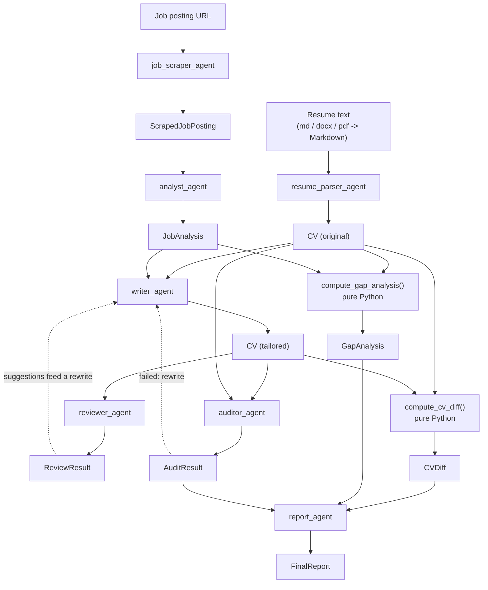
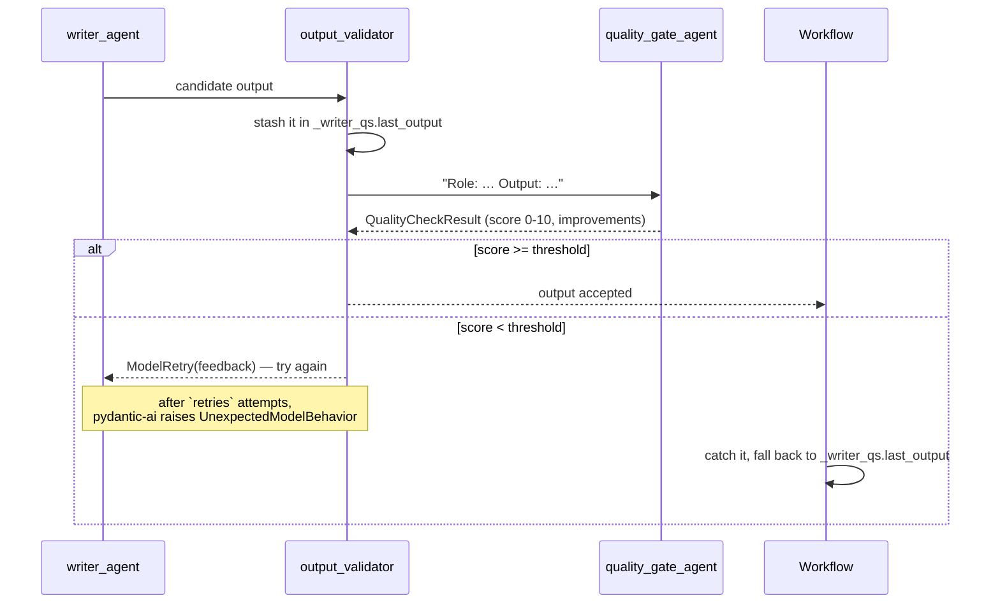

# Agent reference

Every agent is a module-level [`pydantic-ai`](https://ai.pydantic.dev) `Agent`
singleton defined in `sira/workflows/agents.py`. This page is the lookup table:
what each one produces, how often it retries, and whether the quality gate scores it.

## Inventory

| # | Agent | Output type | Retries | Quality gate | Used in |
| --- | --- | --- | :-: | :-: | --- |
| 0 | `job_scraper_agent` | `ScrapedJobPosting` | 3 | no | CLI, before the pipeline |
| 1 | `resume_parser_agent` | `CV` | 2 | no | stage 1 |
| 2 | `analyst_agent` | `JobAnalysis` | 2 | no | stage 2 |
| 3 | `writer_agent` | `CV` | 2 | **yes** | stage 3 and refinement |
| 4 | `reviewer_agent` | `ReviewResult` | 5 | no | stage 4 |
| 5 | `auditor_agent` | `AuditResult` | 2 | **yes** | stage 5 |
| 6 | `report_agent` | `FinalReport` | 5 | no | stage 6 |
| — | `quality_gate_agent` | `QualityCheckResult` | 2 | n/a | validator for gated agents |
| — | `cover_letter_writer_agent` | `str` | 2 | **yes** | **not wired into the workflow** |
| — | `scraper_agent` | `JobAnalysis` | 5 | no | legacy, **not used by the CLI** |

!!! note "Retry counts are per agent"
    They are set inline at each `Agent(...)` call site. Do not assume a single value
    across the file — older documentation claiming a uniform `retries=5` is stale.

## What flows between them



Everything ending in `_agent` is a model call. `compute_cv_diff()` and
`compute_gap_analysis()` are deterministic Python — no model decides what the report
says you are missing.

## The quality gate

The gate is a second agent scoring the first one's output.



Three properties follow from this design:

- **It is advisory, not blocking.** The output is scored once. A retry happens only
  when the score is below `--gate-threshold` (default 6).
- **It never fails the run.** When retries are exhausted, `UnexpectedModelBehavior` is
  caught and the last stashed output is used. Degraded output beats no output.
- **It costs tokens.** Each gated call adds a scoring call. `--no-quality-gate` removes
  them entirely.

### Fallback state objects

| Object | Written by | Read by |
| --- | --- | --- |
| `_writer_qs` | `_validate_writer` | `workflows/__init__.py` (stage 3) |
| `_auditor_qs` | `_validate_auditor` | `workflows/__init__.py` (stage 5) |
| `_cover_qs` | `_validate_cover_letter_writer` | nothing — the agent is unwired |
| `_parser_qs` | nothing — the parser is ungated | `workflows/__init__.py`, `memory/parser.py` |
| `_analyst_qs` | nothing — the analyst is ungated | `workflows/__init__.py` (stage 2) |

The last two rows are the current state, not a bug you need to fix in passing: the
parser and analyst gates were removed for speed, so their fallback branches exist but
never fire. If you re-add a gate for either, the fallback works again as written.

## Tools

`job_scraper_agent` is the only agent with tools:

| Tool | Kind | Signature |
| --- | --- | --- |
| `fetch_webpage` | `@tool` (async) | `(ctx, url: str, timeout: int = 30) -> str` |
| `validate_extraction` | `@tool_plain` | `(raw_html: str, extracted_markdown: str) -> dict` |

`fetch_webpage` drives headless Chromium through Playwright, waits for the network to
go idle and for `<body>` to exist, and returns raw HTML. It rejects any URL that does
not start with `http://` or `https://`.

`read_job_content_file` in `sira/tools/playwright.py` belongs to the legacy
`scraper_agent` and is not part of the live pipeline.

## System prompt rules

The prompts are the product. These are the rules they encode — keep them consistent if
you edit `agents.py`.

### Resume Parser

1. Extract **all** information; leave nothing behind.
2. Pull skills from *every* section: summary, experience, projects, certifications,
   education, publications.
3. A senior resume should yield 40+ individual skills.
4. Do **not** add or modify anything.
5. Preserve every hyperlink in `[text](url)` form.

### CV Writer

1. Use only skills and experiences present in the original CV.
2. **Rephrase** freely; **never** add a new skill or experience.
3. Highlight the experience that matches the job.
4. Work the job's keywords into existing content naturally.
5. Avoid AI clichés — "orchestrated", "spearheaded", "leveraged", "synergy",
   "tapestry", "game-changer".
6. Move relevant skills to the top of the skills section.
7. Preserve every hyperlink from the original.

### Auditor

| Check | What it looks for |
| --- | --- |
| Hallucination | New skills, companies, roles, or achievements. Every bullet must trace back to the original. |
| AI cliché | The blacklist above, plus "dynamic" and "innovative". |
| Hyperlink preservation | Links still in `[text](url)` form, not flattened to plain text. |
| Relevance | The CV foregrounds experience matching the job. |
| Quality | Sound structure, quantified achievements, consistent dates. |

**Pass criteria:** hallucination score ≤ 2, AI cliché score ≤ 3, all hyperlinks intact.

## Shared machinery

### `run_agent()`

Every agent call goes through this helper rather than `agent.run()` directly:

```python
async def run_agent(
    agent: Agent,
    prompt: str,
    *,
    verbose: bool = False,
    agent_label: str = "",
    usage: Usage | None = None,
    usage_limits: UsageLimits | None = None,
) -> AgentRunResult: ...
```

It resolves the per-agent model tier through `resolve_model(agent_label)`, emits
lifecycle and token events to the active progress reporter, and — with `verbose=True` —
streams `TextPartDelta` and `ThinkingPartDelta` events to the console, falling back to
a non-streaming call if streaming fails.

`agent_label` is not cosmetic: it selects the model tier and names the stage in the
dashboard. Passing the wrong label puts an agent on the wrong model.

### Model and gate configuration

| Function | Effect |
| --- | --- |
| `get_model()` / `set_model()` / `reset_model()` | read or override `MODEL_NAME` |
| `set_agent_models(fast=…, strong=…)` | configure the two tiers |
| `reset_agent_models()` | back to the import-time default (called by `conftest.py`) |
| `resolve_model(label)` | the model for one agent, or `None` to use its own default |
| `apply_model_override(model)` | apply `--model` everywhere; idempotent; preserves tiers already set |
| `set_quality_gate(enabled=…, threshold=…)` | configure the gate |
| `reset_quality_gate()` | back to enabled, threshold 6 |

Shared constants:

```python
MODEL_NAME = "openai:gpt-5-mini"
MODEL_SETTINGS: dict = {}
USAGE_LIMITS = UsageLimits(request_limit=1000)
QUALITY_GATE_ENABLED = True
QUALITY_GATE_THRESHOLD = 6
```

!!! warning "Agent construction must stay credential-free"
    `_build_default_model()` builds the default model object using a real
    `OPENAI_API_KEY` when one exists and a placeholder otherwise. Passing a model
    **string** to `Agent(...)` would make pydantic-ai construct the provider's HTTP
    client eagerly, which used to crash `import sira` for anyone running
    `--model ollama:…` without an OpenAI key. Do not regress this.

## Workflow constants

| Constant | Default | Meaning | CLI override |
| --- | :-: | --- | --- |
| `MAX_RETRIES` | 3 | Retries for the parse and analyse stages | — |
| `max_write_attempts` | 2 | Writer attempts in the outer loop | `--write-attempts` |
| `max_review_iterations` | 1 | Reviewer iterations per write attempt | `--review-iterations` |

Pipeline stages, each tracked as `pending` → `running` → `done` / `failed`:

```python
STAGES = [
    "PARSING_RESUME",
    "ANALYZING_JOB",
    "WRITING_CV",
    "REVIEWING_CV",
    "AUDITING_CV",
    "GENERATING_REPORT",
]
```

To add an agent of your own, see [Extending Sira](extending.md).
