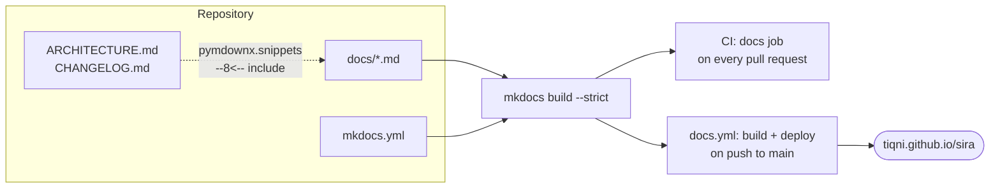

# Contributing

## Setting up

```bash
git clone https://github.com/Tiqni/sira
cd sira
uv sync                              # production + dev dependencies
uv run playwright install chromium   # only needed to run the scraper
export OPENAI_API_KEY=sk-…           # only needed to run the CLI, not the tests
```

`.python-version` pins the interpreter to 3.13, so `uv sync` builds the same
environment CI does. Always go through `uv` — never bare `python`, `python3`, or `pip`.

| Task | Command |
| --- | --- |
| Add a runtime dependency | `uv add <pkg>` |
| Add a development dependency | `uv add --dev <pkg>` |
| Re-sync after pulling | `uv sync` |

## The gate you must pass before pushing

Run this before every push or pull request:

```bash
uv run ruff format . && uv run ruff check --fix . && uv run ruff format --check . && uv run ruff check . && uv run pytest
```

The first two commands fix what can be fixed automatically. The `--check` /
no-`--fix` reruns then fail loudly on whatever is left, which is exactly what CI does.
Do not push if any step exits non-zero.

## Tests

```bash
uv run pytest                                        # everything
uv run pytest -q tests/workflows/test_model_tuning.py  # one file
uv run pytest -k "quality_gate and fallback" -q      # by name
uv run pytest --cov=sira --cov-report=term-missing   # with coverage
```

**No test ever reaches a real model.** `tests/conftest.py` sets
`models.ALLOW_MODEL_REQUESTS = False` and injects a dummy `OPENAI_API_KEY`, so a test
that accidentally makes a live call fails instead of spending money. Async tests use
`pytest-anyio` and are marked with `@pytest.mark.anyio`.

!!! warning "Global state must be reset in tests"
    Model selection and quality-gate configuration live in **module-level globals**
    (`MODEL_NAME`, `FAST_MODEL`, `STRONG_MODEL`, `QUALITY_GATE_ENABLED`,
    `QUALITY_GATE_THRESHOLD`). `conftest.py` calls `reset_agent_models()` around each
    test. If your test sets a model or a gate value, reset it in a `finally` block, or
    you will leak state into whichever test runs next.

## Documentation

The docs site is built with [MkDocs](https://www.mkdocs.org) and the
[Material theme](https://squidfunk.github.io/mkdocs-material/), from the Markdown files
in `docs/`.

```bash
uv sync --group docs
uv run mkdocs serve            # live preview at http://127.0.0.1:8000
uv run mkdocs build --strict   # exactly as CI runs it
```

`--strict` turns warnings into failures. A link to a page that does not exist, a dead
anchor, or a missing snippet include fails the build rather than shipping a broken
site.

### How the site is wired



Two rules keep it honest:

- **`ARCHITECTURE.md` and `CHANGELOG.md` are not copied into `docs/`.** They stay at
  the repository root, and the pages `architecture.md` and `changelog.md` pull them in
  with a snippet include (`--8<-- "ARCHITECTURE.md"`). There is one copy of each, so
  they cannot drift apart.
- **Every page must be in the `nav:` list** in `mkdocs.yml`. A page that is not
  reachable from the navigation is a page nobody reads.

Documentation ships with the change, not as a follow-up. If you add a CLI flag, it
belongs in [CLI reference](cli.md) in the same pull request.

## Conventional Commits are required

Every commit message **and** every pull request title must follow
[Conventional Commits](https://www.conventionalcommits.org/):

```
<type>[optional scope][!]: <description>
```

Types: `feat`, `fix`, `docs`, `refactor`, `test`, `perf`, `build`, `ci`, `chore`,
`style`, `revert`. Imperative mood, lowercase, no trailing period.

This is not a style preference. `cz bump` derives the next version number and the
changelog from commit history. Because pull requests are **squash-merged**, the PR
title becomes the commit on `main` — so a non-conforming title silently breaks the
release, not just the log.

```
feat(cli): add --gate-threshold flag
fix: reject job URLs without a scheme
docs: document the parse cache invalidation rules
```

## Working in a worktree

`AGENTS.md` asks that feature work happen in an isolated
[git worktree](https://git-scm.com/docs/git-worktree) — a second working directory
attached to the same repository — so `main` stays clean. Commit and push only when
asked.

## Continuous integration

Every pull request against `main` runs:

| Job | What it checks |
| --- | --- |
| `test` | `ruff check`, `ruff format --check`, and `pytest` with coverage. Posts a coverage comment on the PR. |
| `docs` | `mkdocs build --strict` — the docs site still builds and has no dead links. |

Pushes to `main` additionally run the release workflow (version bump and changelog via
commitizen) and the docs deployment.

## Releasing

Versioning is handled by [commitizen](https://commitizen-tools.github.io/commitizen/)
and is automated in `.github/workflows/release.yml`:

1. A push to `main` runs `cz bump --files-only`, which computes the next version from
   commit history and updates `pyproject.toml` and `CHANGELOG.md`.
2. Those changes are pushed to a `release/vX.Y.Z` branch and a pull request is opened.
3. Merging that PR (its title starts with `chore(release):`) triggers the tag and the
   GitHub Release.

To do it by hand locally:

```bash
uv run cz bump
git push --follow-tags
```

## One-time repository settings

Two settings live in the GitHub web interface, not in this repository, and are easy to
miss when forking or standing up a new instance:

- **Settings → Pages → Source = "GitHub Actions".** Without it, the `build` job in
  `docs.yml` succeeds while `deploy` fails with an opaque error, and every
  `tiqni.github.io/sira` link stays dead.
- **Actions → General → Workflow permissions** must allow the release workflow to
  create pull requests.

## Design principles

Keep these in mind when changing behaviour:

1. **Authenticity first.** Output must read as written by a person.
2. **No hallucinations.** Never add information absent from the original CV.
3. **ATS optimisation.** Work keywords in naturally; never keyword-stuff.
4. **Deterministic where possible.** The CV diff and gap analysis are pure Python, not
   model output, so the report cannot flatter the user.
5. **Graceful degradation.** When a quality gate is exhausted, fall back to the last
   good output instead of crashing.
