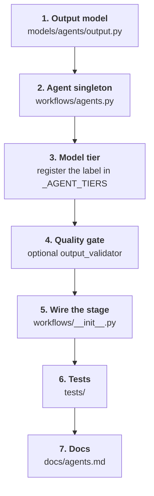
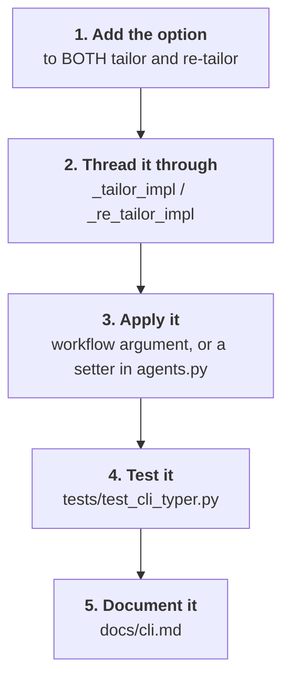

# Extending Sira

Two changes come up often: adding a pipeline agent, and adding a CLI flag. Both touch
more files than you would expect, so here is the full list for each.

## Add a pipeline agent



### 1. Define the output type

Stages talk to each other through Pydantic models, not free text. Put yours in
`sira/models/agents/output.py`:

```python
class MyAgentOutput(BaseModel):
    verdict: str
    reasons: list[str] = Field(description="Why, one point per item.")
```

Write a `description` on every field. It is part of the prompt the model sees, so it
does real work.

### 2. Create the agent

In `sira/workflows/agents.py`, next to the others:

```python
my_agent = Agent(
    _DEFAULT_MODEL,          # the shared model object, NOT a model string
    model_settings=MODEL_SETTINGS,
    system_prompt=(
        "You are a…\n"
        "Rules:\n"
        "1. …\n"
    ),
    output_type=MyAgentOutput,
    retries=2,
)
```

!!! danger "Never pass a model string here"
    `Agent("openai:gpt-5-mini", …)` makes pydantic-ai build the provider's HTTP client
    at import time, which requires an `OPENAI_API_KEY` even for someone running
    `--model ollama:…`. That used to crash `import sira`. Always pass `_DEFAULT_MODEL`.

### 3. Register a model tier

Add your agent's label to `_AGENT_TIERS`:

```python
_AGENT_TIERS = {
    …
    "My Agent": "fast",   # or "strong"
}
```

The key must match the `agent_label` you pass to `run_agent()` exactly. An unknown
label silently falls back to the strong tier — no error, just a bigger bill.

### 4. Add a quality gate (optional)

Only if the output is worth a second model call to score.

```python
_my_qs = _QualityState()

@my_agent.output_validator
async def _validate_my_agent(ctx: RunContext[None], output: MyAgentOutput) -> MyAgentOutput:
    _my_qs.last_output = output          # stash BEFORE scoring — this is the fallback
    await _score_output(
        role="My Agent",
        label="My Agent",
        payload=output.model_dump_json(indent=2),
        ctx=ctx,
    )
    return output
```

`_score_output()` handles the gate being disabled, emits the score to the reporter, and
raises `ModelRetry` with the improvement list when the score is below the threshold.
Stash the output *before* scoring, or an exhausted gate leaves you with no fallback.

### 5. Wire the stage into the workflow

In `sira/workflows/__init__.py`:

1. Add a stage name to `STAGES`.
2. Call `self._set_stage("MY_STAGE")` before the work and
   `self._complete_stage("MY_STAGE")` after it.
3. Run it through `run_agent`, and catch an exhausted gate:

```python
try:
    result = await run_agent(my_agent, prompt, agent_label="My Agent", ...)
    my_output = result.output
except UnexpectedModelBehavior:
    if _my_qs.last_output is not None:
        print("⚠️ My Agent quality gate exhausted — using best available output")
        my_output = _my_qs.last_output
    else:
        print("⚠️ My Agent quality gate exhausted with no fallback — skipping")
        my_output = None
```

Never let an exhausted gate end the run. Degraded output beats no output.

### 6. Test it

- A unit test for the output model's validation rules.
- A workflow test that the stage runs and that the fallback branch works. Follow the
  patterns in `tests/workflows/` — no test may make a real model call.

### 7. Document it

Add a row to the inventory table in [Agent reference](agents.md), and update the
diagram there if data flow changed.

## Add a CLI flag



The two commands duplicate their option lists. Adding a flag to only one of them is the
usual mistake.

```python
@app.command()
def tailor(
    ...,
    my_option: str = typer.Option("default", help="What it does"),
) -> int:
    return asyncio.run(_tailor_impl(..., my_option=my_option))
```

If the flag configures agent behaviour rather than the workflow, apply it through the
setters in `agents.py` (`set_model`, `set_agent_models`, `set_quality_gate`) **before**
the scraper runs — the scraper and the cache parser execute outside the workflow and
would otherwise miss it.

!!! warning "Reset global state in your tests"
    Those setters mutate module-level globals. `conftest.py` resets model state around
    each test; if your test changes gate configuration, reset it in a `finally` block.

## Change what an agent is told

System prompts live inline in `sira/workflows/agents.py`. Two rules to preserve:

- **Anti-hallucination.** The writer may rephrase existing content and nothing more.
- **The cliché blacklist** — "spearheaded", "leveraged", "synergy", "tapestry",
  "game-changer", "orchestrated". It appears in more than one prompt (the writer avoids
  the words; the auditor detects them). Change one, change the other.

## Change the report

`CVDiff` and `GapAnalysis` are computed in `sira/utils/cv_diff.py` in pure Python. Keep
them that way. The model writes the prose around those numbers; it must not be the one
deciding which keywords are missing, or the report stops being trustworthy.

The Markdown layout lives in `generate_report_markdown()` in
`sira/utils/markdown_writer.py`, and the terminal version in `_print_report_to_console()`
in `sira/main.py`. Changing one section usually means changing both.
