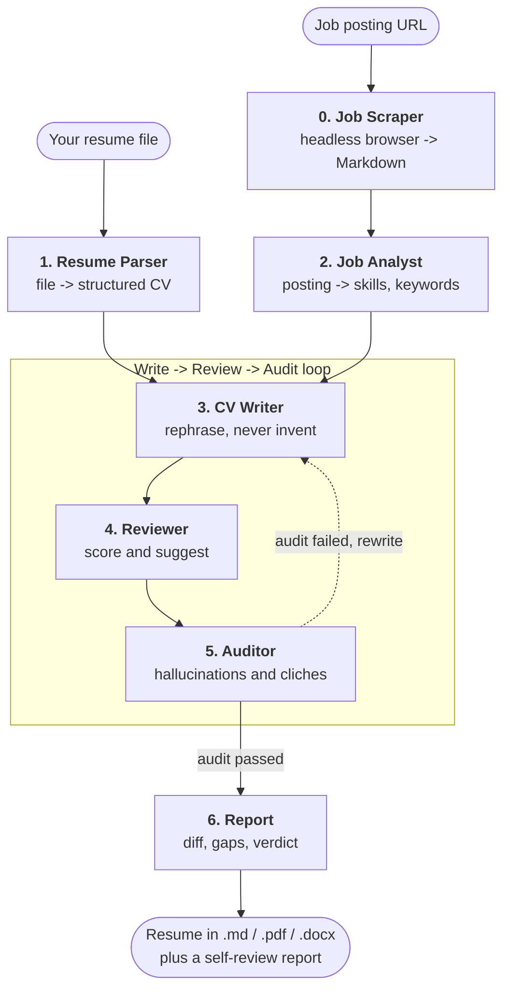

# Sira

Multi-agent AI that tailors your resume to a job posting — **without inventing facts**.

> **Sira** (سيرة) is the Arabic word for a life story. *Sīra dhātiyya* (سيرة ذاتية) is the
> term for a curriculum vitae — the story you tell about your own work.

Sira is a command-line tool. You give it a job posting URL and your resume file. It
scrapes the posting, rewrites your resume to match the role, audits the result for
invented facts and AI clichés, and writes a self-review report telling you where you
still fall short.

## What it does, in order



| Stage | Agent | What happens |
| --- | --- | --- |
| 0 | Job Scraper | Fetches the posting with a headless browser and converts it to Markdown |
| 1 | Resume Parser | Turns your `.md` / `.docx` / `.pdf` resume into a structured `CV` object |
| 2 | Job Analyst | Extracts required skills, responsibilities, and ATS keywords |
| 3 | CV Writer | Rephrases *existing* content to match the role |
| 4 | Reviewer | Scores the draft and suggests refinements |
| 5 | Auditor | Checks for hallucinations, clichés, and dropped hyperlinks |
| 6 | Report | Compiles the diff, gap analysis, and recommendation |

Stages 3–5 form a loop: a failed audit sends the draft back to the writer.
See [Architecture](architecture.md) for the full picture.

**ATS** (Applicant Tracking System) — the software an employer uses to filter resumes
before a human reads them. It matches on keywords, which is why keyword coverage is
scored in the report.

## The rule that makes it useful

The writer may **rephrase** what is already in your resume. It may **not** add a skill,
a company, a role, or an achievement that is not there. The auditor exists to enforce
that rule, and the report tells you honestly which job requirements you do not meet
rather than papering over them.

## Install

```bash
git clone https://github.com/Tiqni/sira
cd sira
uv sync
uv run playwright install chromium
export OPENAI_API_KEY=sk-…
```

Then run it:

```bash
uv run sira tailor https://example.com/jobs/12345 ~/resume.md
```

Full walkthrough: [Getting started](getting-started.md).

## Where to go next

| If you want to | Read |
| --- | --- |
| Install it and run it for the first time | [Getting started](getting-started.md) |
| Look up a command or a flag | [CLI reference](cli.md) |
| Use Anthropic, Gemini, Groq, or a local model | [Models and providers](models.md) |
| Understand the generated files and the report | [Output and reports](output.md) |
| Know what is stored on disk, and where | [Resume memory](memory.md) |
| Fix an error you just hit | [Troubleshooting](troubleshooting.md) |
| Set up a development environment | [Contributing](contributing.md) |
| Find your way around the source tree | [Project layout](project-layout.md) |
| Look up an agent, its prompt rules, or its output type | [Agent reference](agents.md) |
| Add an agent or a CLI flag | [Extending Sira](extending.md) |
| Understand how the whole system fits together | [Architecture](architecture.md) |

## Requirements

- **Python 3.13+**
- **[uv](https://github.com/astral-sh/uv)** — the package manager and runner this project uses
- **A Chromium browser for Playwright** — installed once with `uv run playwright install chromium`
- **An API key** for whichever LLM provider you pick (OpenAI by default)

## Licence

[MIT](https://github.com/Tiqni/sira/blob/main/LICENSE).
