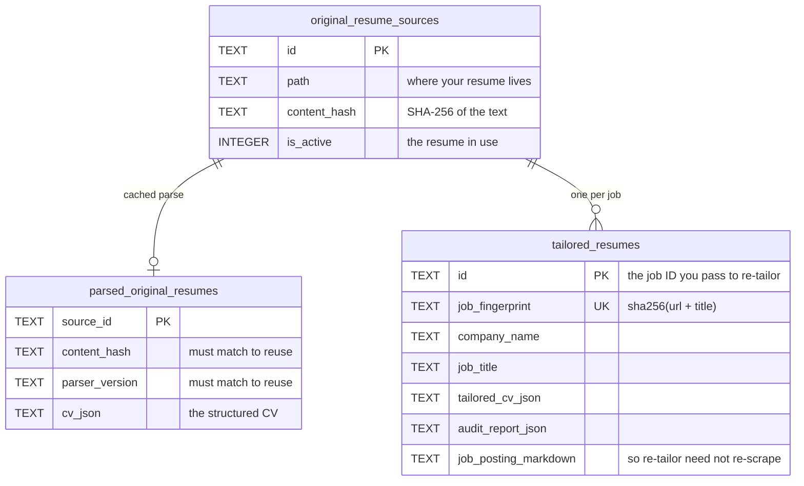
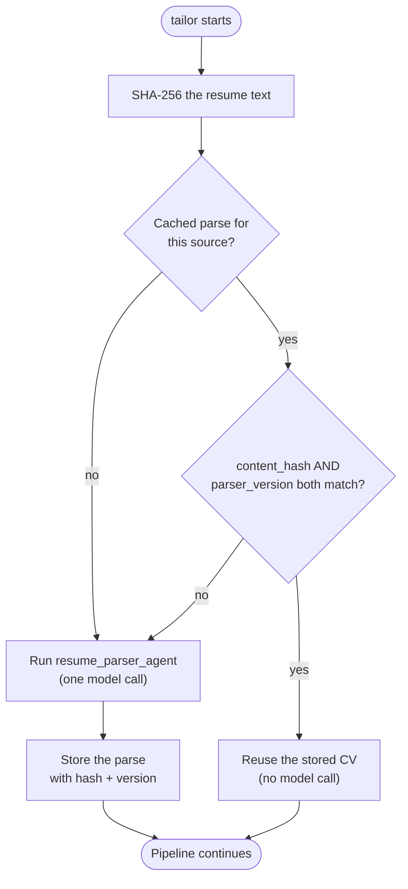

# Resume memory

Sira keeps a small local database so that repeat runs are cheaper and always start from
the same place: your **original** resume.

## Where it lives

```
<data dir>/resume_memory.sqlite3
```

`<data dir>` is Sira's per-user data directory, so the same database is used from any
working directory:

| Platform | Default |
|----------|---------|
| macOS    | `~/Library/Application Support/sira` |
| Linux    | `$XDG_DATA_HOME/sira` (`~/.local/share/sira`) |
| Windows  | `%LOCALAPPDATA%\sira` |

Set `SIRA_DATA_DIR` to use another directory. The DBOS checkpoint database
(`dbos.sqlite3`, see [`resume`](cli.md#resume)) lives in the same place
unless `SIRA_DBOS_DATABASE_URL` points elsewhere.

The directory is created automatically on first use. Nothing is uploaded anywhere; the
database is a plain SQLite file on your machine.

!!! note "Upgrading from a release before 1.5"
    Older releases wrote `memory/resume_memory.sqlite3` relative to the directory you
    ran `sira` from. The first time Sira runs from a directory that has such a file, it
    moves it into the data directory (unless a database already exists there) and prints
    where it went.

## What it stores



## The parse cache

Parsing a resume into a structured `CV` costs a model call. Sira skips it when it can.



Two things invalidate the cache, and both should:

- **You edited your resume.** The content hash changes, so the old parse is stale.
- **The parser itself changed.** `parser_version` (`_PARSER_VERSION` in
  `sira/memory/parser.py`, currently `2.1.0`) is bumped when the parsing prompt or the
  `CV` schema changes, so old parses are not silently reused under new rules.

## Rules the memory layer enforces

- The **first run must be given a resume path**, so there is something to store.
- Later runs reuse the stored active original resume.
- **Every job starts from the original resume** — never from a previously tailored one.
  Tailoring on top of tailoring is how a resume drifts away from the truth.
- Each successful run stores the tailored CV, the audit report, and the scraped job
  posting, all linked back to the original source.

## Job IDs and `re-tailor`

A successful run prints a **job ID** — the primary key of the `tailored_resumes` row.
Pass it to `re-tailor` to iterate without re-scraping:

```bash
uv run sira re-tailor <JOB_ID> "Lead with the platform migration work"
```

Because `job_posting_markdown` was stored, `re-tailor` reuses the posting text
directly. No browser is launched and no scrape happens.

Each job is also given a fingerprint — `sha256(job_url + ":" + job_title)`, truncated —
which is unique in the table. Running `tailor` again for the same URL and title updates
that row rather than creating a second one.

!!! warning "If you move your resume file"
    `re-tailor` looks up the original resume at its recorded path. If the file is gone,
    the run fails and tells you to pass `--resume-path` pointing at the new location.

## Starting over

The database is a single file in the [data directory](#where-it-lives). To wipe all
stored resumes and history on macOS:

```bash
rm ~/Library/Application\ Support/sira/resume_memory.sqlite3*
```

Use the matching path on Linux (`~/.local/share/sira/`) or Windows
(`%LOCALAPPDATA%\sira\`), or `$SIRA_DATA_DIR` if you set it. The `*` also removes the
`-wal` and `-shm` sidecar files SQLite keeps next to the database. The next run
recreates the schema and treats your resume as new. `dbos.sqlite3` in the same directory
holds the run checkpoints; delete it too if you want to forget past runs.
