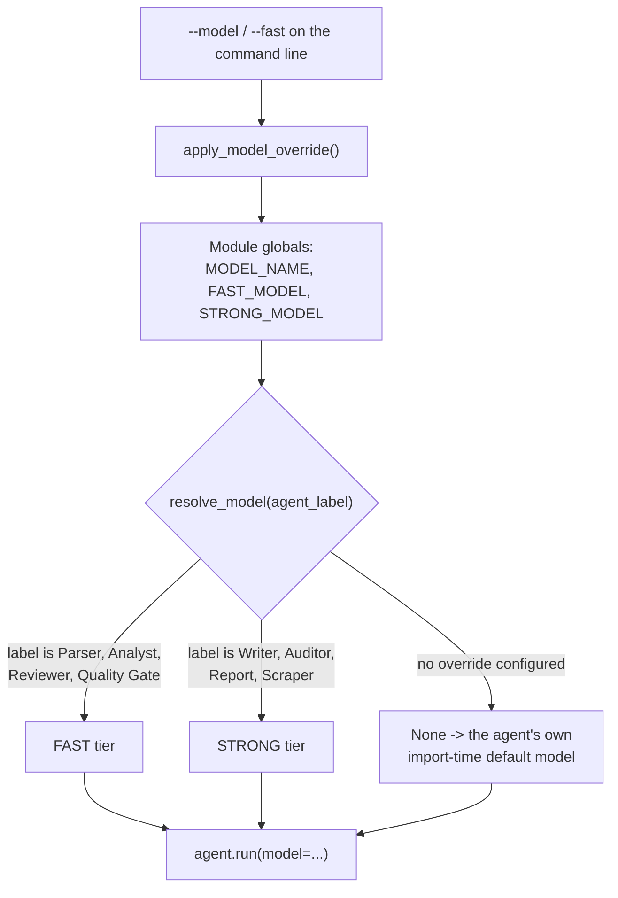

# Models and providers

Sira is built on [PydanticAI](https://ai.pydantic.dev), which speaks to many LLM
providers behind one interface. You pick one with `--model`, using the format
**`<provider>:<model>`**.

The default is `openai:gpt-5-mini`.

```bash
uv run sira tailor <JOB_URL> <RESUME_PATH> --model anthropic:claude-sonnet-4-5
```

## Supported providers

| Provider | Prefix | Example `--model` | Environment variable |
| --- | --- | --- | --- |
| [OpenAI](https://platform.openai.com) | `openai:` | `openai:gpt-4o-mini` | `OPENAI_API_KEY` |
| [Anthropic](https://console.anthropic.com) | `anthropic:` | `anthropic:claude-sonnet-4-5` | `ANTHROPIC_API_KEY` |
| [Google Gemini](https://aistudio.google.com) | `google:` | `google:gemini-3-pro-preview` | `GOOGLE_API_KEY` |
| [Google Cloud (Vertex AI)](https://cloud.google.com/vertex-ai) | `google-cloud:` | `google-cloud:gemini-3-flash-preview` | `GOOGLE_API_KEY` |
| [Groq](https://console.groq.com) | `groq:` | `groq:llama-3.3-70b-versatile` | `GROQ_API_KEY` |
| [Mistral](https://console.mistral.ai) | `mistral:` | `mistral:mistral-large-latest` | `MISTRAL_API_KEY` |
| [xAI](https://x.ai/api) | `xai:` | `xai:grok-3-mini` | `XAI_API_KEY` |
| [Cohere](https://dashboard.cohere.com) | `cohere:` | `cohere:command-r-plus` | `COHERE_API_KEY` |
| [DeepSeek](https://platform.deepseek.com) | `deepseek:` | `deepseek:deepseek-chat` | `DEEPSEEK_API_KEY` |
| [OpenRouter](https://openrouter.ai) | `openrouter:` | `openrouter:openai/gpt-4o` | `OPENROUTER_API_KEY` |
| [Ollama](https://ollama.com) (local) | `ollama:` | `ollama:llama3` | `OLLAMA_BASE_URL` |
| [GitHub Models](https://github.com/marketplace/models) | `github:` | `github:xai/grok-3-mini` | `GITHUB_API_KEY` |
| [Cerebras](https://cloud.cerebras.ai) | `cerebras:` | `cerebras:llama3.1-8b` | `CEREBRAS_API_KEY` |
| [AWS Bedrock](https://aws.amazon.com/bedrock) | `bedrock:` | `bedrock:anthropic.claude-sonnet-4-5` | AWS credentials |

You do not need to install anything extra — `pydantic-ai` ships support for every
provider above, and resolves the model class, provider, and profile from the
`provider:model` string.

## How a model reaches an agent

Every agent is created once, at import time, with a shared default model object. The
`--model` value replaces that at run time, per call. Two tiers exist so that
mechanical stages can run on a cheaper model than the ones doing the real writing.



Two consequences worth knowing:

- The override is applied **before** the scraper runs, not inside the workflow. The
  scraper and the cached resume parser run outside the pipeline, and they honour
  `--model` too.
- Without `--fast` or an explicit tier configuration, both tiers point at the same
  model, so `--model` simply applies everywhere.

## Which stages use which tier

| Tier | Stages |
| --- | --- |
| **fast** | Resume Parser, Job Analyst, Reviewer, Quality Gate |
| **strong** | CV Writer, Auditor, Report, Job Scraper, Cover Letter Writer |

`--fast` sets the fast tier to `openai:gpt-5-nano` and the strong tier to `openai:gpt-5-mini`,
or to your `--model` value if you passed one.

!!! warning "`--fast` always uses an OpenAI model for the fast tier"
    Combining `--fast` with, say, `--model anthropic:claude-sonnet-4-5` puts Anthropic
    on the strong tier but leaves `openai:gpt-5-nano` on the fast tier — so you still
    need an `OPENAI_API_KEY`. If you want a single provider end to end, use `--model`
    on its own and tune `--write-attempts` / `--review-iterations` by hand.

## Running a local model with Ollama

[Ollama](https://ollama.com) runs models on your own machine. PydanticAI talks to it
through its OpenAI-compatible endpoint, and **requires** you to say where that endpoint
is — there is no default:

```bash
ollama pull llama3
export OLLAMA_BASE_URL=http://localhost:11434/v1
uv run sira tailor <JOB_URL> <RESUME_PATH> --model ollama:llama3
```

Ollama's cloud models route through the same local daemon. Sign in first with
`ollama signin`:

```bash
export OLLAMA_BASE_URL=http://localhost:11434/v1
uv run sira tailor <JOB_URL> <RESUME_PATH> --model 'ollama:kimi-k2.6:cloud'
```

!!! note "You do not need an OpenAI key for this"
    Agents are deliberately constructed without touching provider credentials at
    import time. If you run with `--model ollama:…` and no `OPENAI_API_KEY`, import
    still succeeds and no OpenAI call is ever made.

!!! warning "Structured output is the hard part for local models"
    Every stage returns a typed object, not free text. Smaller local models are worse
    at producing valid structured output, so expect more retries and occasional
    fallbacks. The quality gate and the retry loops absorb some of that, but a cloud
    provider is more reliable.

## OpenAI-compatible providers

Many services expose an OpenAI-compatible API. PydanticAI reaches them through the
`openai:` prefix plus provider-specific environment variables. See the
[PydanticAI OpenAI docs](https://ai.pydantic.dev/models/openai/) for
[Together AI](https://ai.pydantic.dev/models/openai/#together-ai),
[Perplexity](https://ai.pydantic.dev/models/openai/#perplexity),
[Fireworks AI](https://ai.pydantic.dev/models/openai/#fireworks-ai), and
[Azure AI Foundry](https://ai.pydantic.dev/models/openai/#azure-ai-foundry).

## Controlling cost

Roughly in order of impact:

1. `--no-quality-gate` — removes the scoring call that follows each gated agent.
2. `--fast` — fewer loop iterations plus a cheaper tier for mechanical stages.
3. `--write-attempts 1 --review-iterations 0` — a single pass with no refinement.
4. A cheaper `--model`.

A hard ceiling also exists in code: `USAGE_LIMITS = UsageLimits(request_limit=1000)`
caps the number of model requests in a single run.
