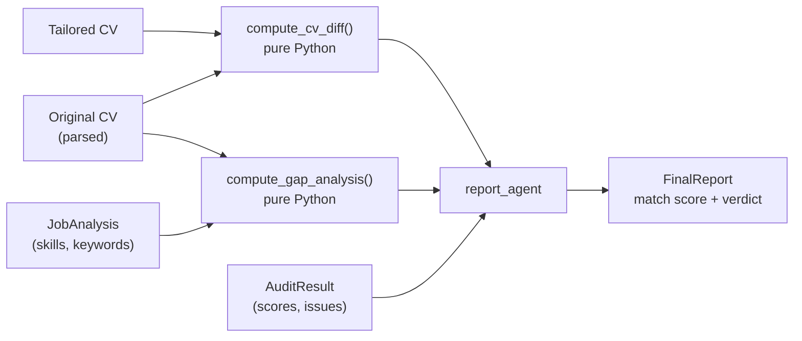

# Output and reports

A finished run writes four files per job, plus the report it prints to your terminal.

## Where files land

```
output/                                   ← --output-dir (default ./output)
├── resume_converted.md                   ← only when the input was .docx or .pdf
└── acme_corp-senior_engineer/            ← --output-pattern
    ├── acme_corp-jane_doe.md             ← --resume-name-pattern
    ├── acme_corp-jane_doe.pdf
    ├── acme_corp-jane_doe.docx
    ├── acme_corp-jane_doe_report.md
    └── resume_debug.md                   ← only with --debug
```

The three resume files hold the same content in three formats. Markdown is the source;
the PDF and DOCX are generated from it.

### Naming patterns

| Pattern option | Default | Controls |
| --- | --- | --- |
| `--output-pattern` | `{company_name}-{job_title}` | the per-job subdirectory |
| `--resume-name-pattern` | `{company_name}-{full_name}` | the resume base filename |

Available variables: `{company_name}`, `{job_title}`, `{full_name}`, `{timestamp}`
(today as `YYYYMMDD`).

Each value is lowercased, spaces become underscores, and every other character is
stripped — so `Acme Corp` becomes `acme_corp`. A resolved name containing a path
separator, `..`, an absolute path, or a control character is rejected and the run exits
with code `1` before writing anything.

```bash
# One directory per job title, one file per day
uv run sira tailor <JOB_URL> <RESUME_PATH> \
  --output-pattern "{job_title}" \
  --resume-name-pattern "{full_name}-{timestamp}"
```

## The self-review report

The report is the honest half of the tool. The resume shows your work in its best
light; the report tells you where that light does not reach.



The two `pure Python` boxes matter: **the diff and the gap analysis are computed in
plain code**, not asked of a model. A model cannot quietly flatter you about which keywords
you are missing, because it never decides that. It only writes the prose around the
numbers.

### Sections in the report

| Section | What it tells you |
| --- | --- |
| **Match Score & Recommendation** | A 0–100 score and a verdict: *Strong Match*, *Partial Match*, or *Weak Match*, with the reasoning. |
| **What Changed** | Whether the summary was rewritten, which skills moved up or down, and which bullet points were rephrased for each role. |
| **Keyword Coverage** | Which ATS keywords from the posting appear in your resume, which do not, and the percentage covered. |
| **Skill Gaps** | Hard and soft skills the job asks for that are genuinely absent from your resume. |
| **Suggestions to Strengthen Your Application** | Concrete things to do — usually about experience you should add to the *original* resume, not to this tailored copy. |
| **Audit Summary** | The auditor's feedback on tone, authenticity, and rule compliance. |

The same content is printed to your terminal at the end of a run.

### Reading the audit scores

Two 0–10 scores come out of the auditor:

| Score | Good value | Meaning |
| --- | --- | --- |
| `hallucination_score` | **low** | 0 means nothing was invented. The pass criterion is ≤ 2. |
| `ai_cliche_score` | **low** | 10 means it reads like a robot. The pass criterion is ≤ 3. |

The auditor also checks that every hyperlink from your original resume survives in
`[text](url)` form. A dropped link fails the audit.

## When the audit fails

A failed audit is not a crash. Sira:

1. Prints the auditor's feedback,
2. **Skips writing the resume files**,
3. Still writes and prints the report,
4. Exits with code `0`.

The report tells you what to fix. Feed it back with
[`re-tailor`](cli.md#re-tailor), or re-run with more attempts:

```bash
uv run sira tailor <JOB_URL> <RESUME_PATH> --write-attempts 3 --review-iterations 2
```

## Converted and debug files

- `resume_converted.md` is written into `--output-dir` whenever your input was a
  `.docx` or `.pdf`. It is the Markdown that the parser actually saw — useful when the
  parser missed something and you want to know whether the conversion or the model was
  at fault.
- `resume_debug.md` is written into the job directory only with `--debug`, and holds
  the same converted text alongside extra console diagnostics.
