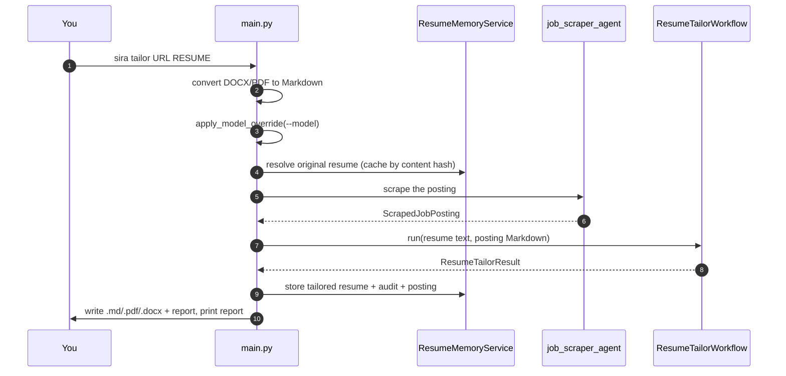

# Project layout

## Package structure

```
sira/                            # the Python package
├── main.py                      # Typer CLI: tailor + re-tailor. Scraping happens HERE.
├── __main__.py                  # `python -m sira` entry point
├── workflows/
│   ├── __init__.py              # ResumeTailorWorkflow — the 6-stage pipeline
│   └── agents.py                # every agent, plus model/quality-gate machinery
├── models/
│   ├── agents/
│   │   ├── output.py            # the typed contracts between stages
│   │   └── deps.py              # agent dependency types
│   └── workflow.py              # ResumeTailorResult
├── memory/
│   ├── models.py                # domain models (ResolvedOriginalResume, …)
│   ├── parser.py                # PydanticAIResumeParser (adapter)
│   ├── repository.py            # abstract ResumeMemoryRepository interface
│   ├── sqlite_repository.py     # the SQLite implementation
│   └── service.py               # ResumeMemoryService — orchestration + caching
├── reporting/
│   ├── base.py                  # ProgressReporter protocol, use_reporter(), NullReporter
│   ├── dashboard.py             # LiveDashboard (Rich); degrades in a non-TTY
│   └── verbose.py               # VerboseReporter (--verbose)
├── tools/
│   ├── playwright.py            # read_job_content_file (legacy agent tool)
│   └── job_scraper_helpers.py   # HTML→Markdown, placeholder detection, cleanup
└── utils/                       # no model calls live in here
    ├── cv_diff.py               # CVDiff + GapAnalysis, pure Python
    ├── markdown_writer.py       # generate_resume, generate_report_markdown
    ├── resume_converter.py      # DOCX/PDF → Markdown (markitdown)
    ├── resume_output_converter.py
    ├── pdf_converter.py         # markdown_to_pdf
    └── validate_inputs.py       # deprecated, unused by the CLI
```

```
tests/
├── conftest.py                  # blocks real model calls; resets global model state
├── factories.py                 # test data builders
├── memory/                      # memory layer
├── reporting/                   # reporters
├── workflows/                   # pipeline, loop config, model tiers, reporter events
└── test_*.py                    # CLI, diff, scraper, quality gate, converters, smoke
```

```
memory/resume_memory.sqlite3     # runtime database (gitignored, auto-created)
output/                          # default output directory (gitignored)
docs/                            # this site
mkdocs.yml                       # site configuration and navigation
```

## Where the surprises are

Reading the code top-down does not tell you the execution order, because the pipeline
is not all inside the workflow class.



Three things that catch people out:

1. **Scraping happens in `main.py`, before the workflow.** So does resolving the
   original resume from memory and applying `--model`. The workflow receives text, not
   a URL.
2. **`--model` mutates module-level globals** in `workflows/agents.py`, and is applied
   before the scraper for exactly that reason.
3. **`CVDiff` and `GapAnalysis` are computed in pure Python** in `utils/cv_diff.py`.
   The report agent writes prose around numbers it did not choose.

## Progress reporting

`sira/reporting/` is a small, context-local abstraction for showing progress. It exists
so that agent code never has to know whether anyone is watching.

- `ProgressReporter` in `reporting/base.py` is a `Protocol` — a structural interface, so
  any object with the right methods qualifies; no base class to inherit from.
- The active reporter lives in a `contextvars.ContextVar`. Get it with
  `get_active_reporter()`, install one for the current async context with the
  `use_reporter(reporter)` context manager.
- `run_agent()` emits stage start/finish, retry, quality-score, and token-streaming
  events to whichever reporter is active.

| Implementation | Used when |
| --- | --- |
| `NullReporter` | tests, and any time no reporter is installed — does nothing |
| `LiveDashboard` | the default. A live Rich panel in a terminal; plain line-by-line logging in a non-TTY such as CI or a pipe |
| `VerboseReporter` | `--verbose`. Streams thinking and output tokens straight to stdout, no live panel |

Reporter calls are best-effort. `_safe_report()` swallows exceptions from a reporter so
that a display bug can never abort a pipeline run.

!!! note "Known limitation"
    The workflow still writes some progress lines with bare `print()`. In an
    interactive terminal those can interleave with the `LiveDashboard` live panel and
    garble the display — cosmetic only. Routing them through the reporter is the fix.

## Speed levers

Four independent mechanisms reduce end-to-end latency. `--fast` turns on all four.

1. **Parallel parse and analyse.** On a cold cache, stages 1 and 2 run concurrently via
   `asyncio.gather`.
2. **Advisory quality gate.** One scoring pass, and a retry only below the threshold —
   not a loop until perfect. Parser and Analyst are not gated at all.
3. **Trimmed loops.** Defaults are 2 write attempts × 1 review iteration, adjustable
   with `--write-attempts` and `--review-iterations`.
4. **Per-agent model tiers.** `set_agent_models(fast=…, strong=…)` and
   `resolve_model(label)` put mechanical stages on a cheaper model.

## Which file to change

| You want to | Edit |
| --- | --- |
| Add or change a CLI flag | `sira/main.py` (both commands) |
| Change what an agent is told to do | `sira/workflows/agents.py` (system prompts) |
| Change the shape of a stage's output | `sira/models/agents/output.py` |
| Change the loop, retries, or fallbacks | `sira/workflows/__init__.py` |
| Change what is stored, or the cache rules | `sira/memory/service.py` |
| Change how progress is displayed | `sira/reporting/` |
| Change how the resume or report file is written | `sira/utils/markdown_writer.py` |
| Change scraping or HTML extraction | `sira/workflows/agents.py` + `sira/tools/job_scraper_helpers.py` |

Most changes land in `workflows/agents.py`. It is the largest and most central file.

## Files that are not what they look like

- `sira/utils/validate_inputs.py` and the `run` target in the `Makefile` are
  **deprecated and broken**. Use `uv run sira …`.
- `cover_letter_writer_agent` and `scraper_agent` exist in `agents.py` but are **not
  wired into the workflow**. `job_scraper_agent` is the one the CLI uses.
